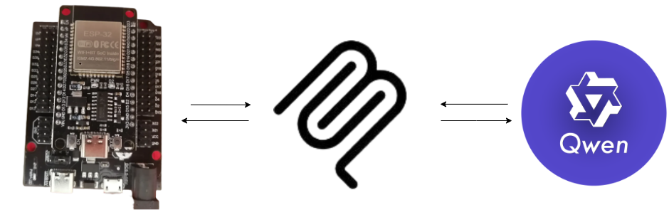

# Comunicación del LLM con el servidor MCP y el ESP32

LLM, el modelo local debe de tener la posibilidad de `manipular herramientas` (icono de un martillo) y `procesar imágenes` (icono de un ojo).


Servidor MCP, es el intermediario entre el LLM y el ESP32, contiene las herramientas necesarias que el modelo puede utilizar y en cada herramienta se tienen comandos que se envían al ESP32 para que los procese y realice acciones. Todas las herramientas se comunican con esta función que se encarga de enviar el comando al ESP32.
``` python

def enviar_comando_esp32(comando: str, esperar_respuesta: bool = True) -> dict:
    """
    Envía un comando al ESP32 y devuelve la respuesta
    """
    if not conectar_esp32():
        return {"ok": False, "error": "ESP32 no conectado"}
    
    try:        
        esp32_serial.reset_input_buffer()
                
        esp32_serial.write(f"{comando}\n".encode("utf-8"))
        
        if not esperar_respuesta:
            return {"ok": True, "respuesta": "Comando enviado"}
                
        respuesta = ""
        start_time = time.time()
        while time.time() - start_time < 2:
            if esp32_serial.in_waiting > 0:
                line = esp32_serial.readline().decode("utf-8", errors="replace").strip()
                if line:
                    respuesta = line
                    break
            time.sleep(0.05)
        
        return {"ok": True, "respuesta": respuesta if respuesta else "Sin respuesta"}
    
    except Exception as e:
        return {"ok": False, "error": str(e)}

```

ESP32, tiene diferentes métodos en los cuales se especifica que componentes (sensores y actuadores puede manipular), además de tener un método que recibe todos los comandos que envía el servidor MCP para decidir qué metodo debe utilizar.
``` cpp

void procesarComando(String comando) {
  comando.toUpperCase();
  
  if (comando == "ON") {
    encenderLED();
  }
  else if (comando == "OFF") {
    apagarLED();
  }
  else if (comando == "STATUS") {
    mostrarEstado();
  }
  else if (comando.startsWith("BLINK")) {
    procesarComandoBlink(comando);
  }
  else if (comando == "DISTANCIA" || comando == "DIST") {
    mostrarDistancia();
  }
  else if (comando.startsWith("AUTO")) {
    procesarComandoAuto(comando);
  }
  else if (comando.startsWith("UMBRAL")) {
    procesarComandoUmbral(comando);
  }
  else if (comando == "HELP") {
    mostrarAyuda();
  }
  else if (comando == "CERRAR"){
    cerrarPuerta();
  }
  else if (comando == "ABRIR"){
    abrirPuerta();
  }
  else {
    Serial.println("Comando no reconocido. Escribe HELP para ayuda.");
  }
}

```

## Proceso de comunicación
1. LLM
    - El usuario ingresa un prompt en LM Studio para indicarle al modelo lo que va a realizar.
    - El modelo procesa la instrucción y determina si va a utilizar una herramienta, capturar una imagen o responder a una pregunta.
    - Solicita permiso al usuario de realizar una acción, en caso de ser permitido, se comunica con el servidor MCP.

2. MCP
    - El LLM mando a llamar a una de las herramientas del MCP, este ejecuta el código en su interior, que a su vez llama a la función que se comunica con el ESP32 o con la función para tomar una foto.
        - Si la instrucción dice que se comunique con un actuador o sensor, entrara a la función que envía el comando.
        - Si la instrucción dice que se va a tomar una foto, entrará a la función para tomar la foto.
            - Se conectará a la webcam, tomará la foto, y retornará la foto para que se vea en el LLM.

3. Analizar foto
    - El servidor MCP se conectará al servidor local de LM Studio.
    - Le dará un prompt al modelo indicandole que la imagen que va a analizar esta en su servidor local, por lo que el modelo podrá ver la imagen y la analizará.
    - El modelo describirá al usuario lo que puede observar en la imagen.

4. ESP32
    - Recibe el comando del servidor MCP y manda a llamar al método correspondiente.
    - Cada método imprime un mensaje que captura el servidor MCP y que a su vez retorna la respuesta al LLM para que muestre al usuario si se realizó con éxito o no la tarea.


## Diagrama de comunicación


