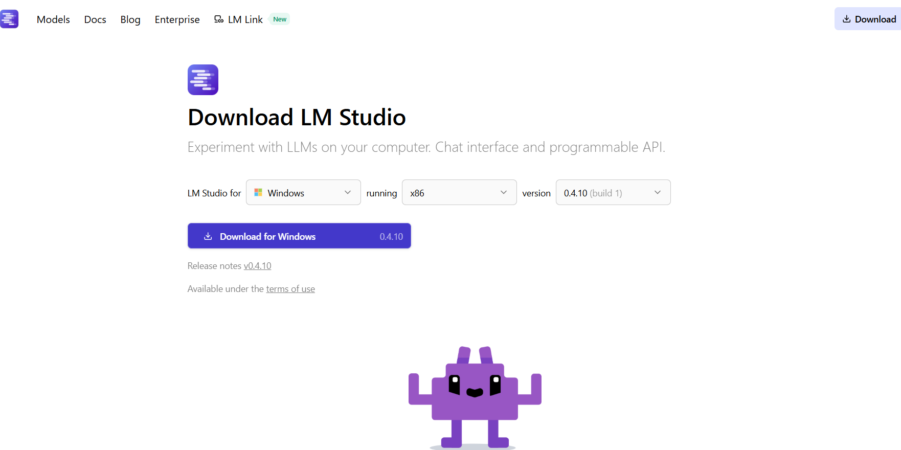
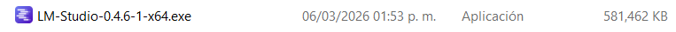
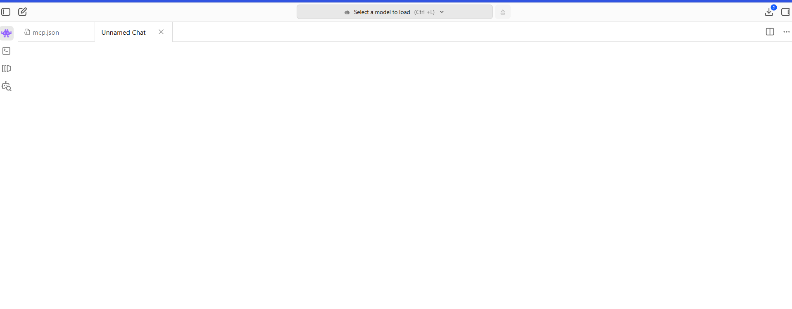
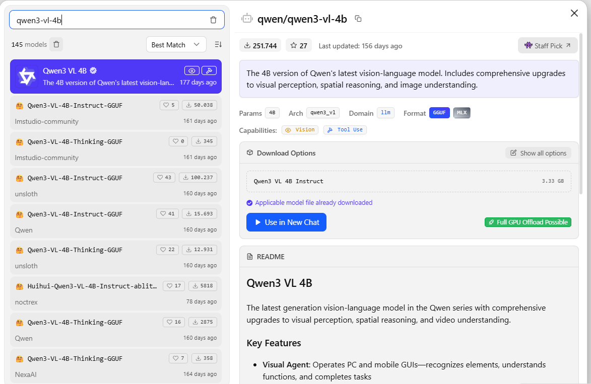
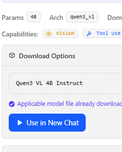
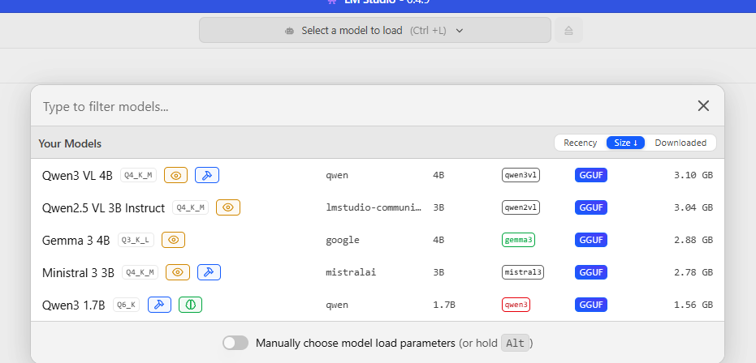
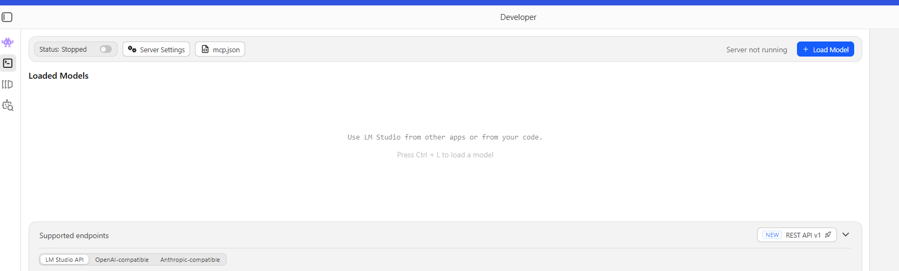
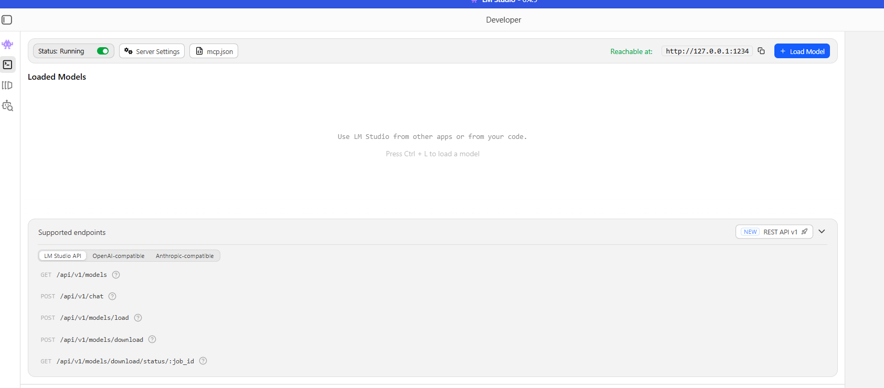

# Configuración e instalación de LM Studio

## Para instalar LM Studio, es necesario cumplir con ciertos requisitos específicos:

## 	Requisitos de hardware 
El consumo de IA depende principalmente de la memoria RAM (o VRAM en la tarjeta gráfica) y la capacidad de cálculo.

> - Nota sobre AVX2: Si usas una PC con Windows muy antigua (anterior a 2013), es posible que el procesador no sea compatible con AVX2. En ese caso, LM Studio podría no abrir o funcionar extremadamente lento.
##    Requisitos por sistema operativo
Si usas Windows, considera lo siguiente: 
Versión: Windows 10 o 11 (64 bits).
##    Requisitos previos a la instalación
Conexión a internet: Solo necesitarás conexión para descargar la aplicación y los modelos. Los modelos suelen pesar entre 2 GB y 4 GB cada uno (considerando el tipo necesario para el proyecto actual). Una vez descargados, LM Studio funciona completamente sin conexión.

# Descarga de LM Studio
Enlace de descarga para LM Studio: 
[Visita lmstudio.ai](https://lmstudio.ai/download)

## Una vez completada la descarga ejecuta la aplicación :

## Deberías apreciar la pantalla principal.

## Búsqueda del modelo
En la barra lateral izquierda hay un icono. Si pasas el mouse sobre él, verás la etiqueta **Model search**. Selecciona ese icono para realizar la descarga del modelo.
Recomendaciones de modelos:
Mínimo recomendado: **Ministral-3-3B-Instruct-2512-GGUF**
Mejor rendimiento (si el hardware lo permite): **qwen/qwen3-vl-4b** (ofrece mejores respuestas y mayor eficiencia)

> - Nota importante: Asegúrate de que el modelo seleccionado tenga capacidad de visión y uso de herramientas (totalmente necesario para el proyecto). Además, verifica que sea posible su descarga. Si no cumple estos requisitos, no se recomienda descargarlo, ya que no funcionará de manera eficiente.
## Cargar modelo
Una vez descargado el modelo, selecciona abrir una nueva conversación: 

O en su defecto si descargas otro deberías ir a la barra superior de búsqueda y seleccionar el modelo deseado:

## Configuración de **local server** del LM Studio 
En la barra lateral izquierda, selecciona el icono de una consola nombrado Developer, Si pasas el mouse, verás el estado: status: stopped.

Pulsa el botón y actívalo, aparecerá una dirección deberá mostrar lo siguiente: 127.0.0.1 : 1234 /v1/chat/completions

- 127.0.0.1 : tu propia PC (localhost) 
- 1234: puerto donde corre LM Studio 
- /v1/chat/completions: endpoint tipo OpenAI

Esta configuración permitirá que el código en Python se comunique con LM Studio.

Considera cerrar aplicaciones: Al ejecutar modelos grandes, es recomendable cerrar navegadores como Chrome o programas de edición de video que consuman mucha memoria simultáneamente para mejorar la eficiencia del modelo.